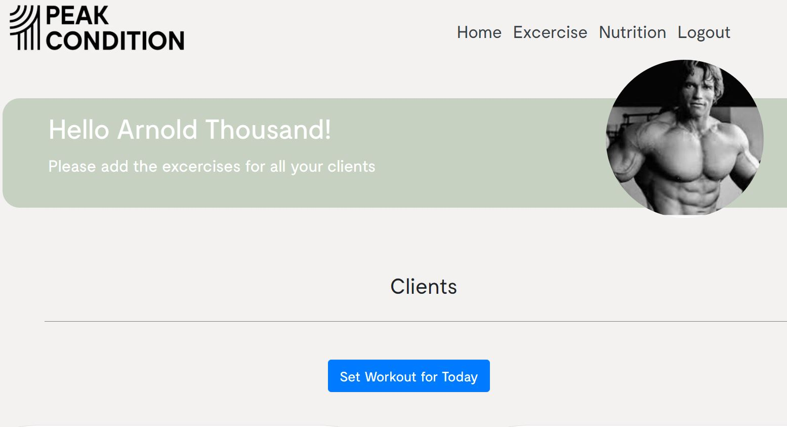
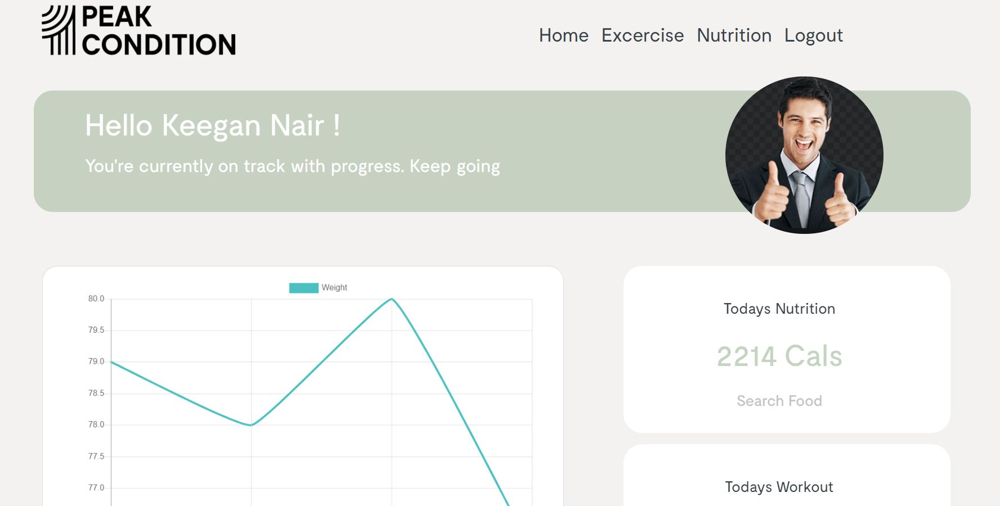

# Project3 React

### Preak-Condition.
DEPLOYED LINK ON HEROKU: https://peak-condition.herokuapp.com/login

#### Project description 
This application will allow trainers to provide a client with a workout program and also allow a client to view their work that has been assigned to them.

Overall, the focus point of this application was to create a applciation that would be able to allow trainers to assign workout programs more easier.

#### Project Management
* Progression was tracked on a trello board.

##### User Story
As a Trainer 
I want to assign workout program to clients as easy as possible
So that they can avoid the inconvenience of going back and fourth when view programs.

#### Wireframe/sketch of the design.
Coach home page
 

Client Side Home page

#### How to Use
* Create a account as a coach if you are using it for the first time. (Remember your email and password that you use)
* create a account for a client and assign that client to the coach you have created.
* Once you have done that, login to the coach side and assign a workout program for the created client by clicking on set workout for today. Once you have done that you can view the workout for the client by clicking on the client  details when you hit the home button.
* you can view your program for a client when you login as a client and clicking on start workout for today which would show your workout for the day.

#### Technologies 
Project is created with:

* ReactJS
* NodeJS
* Express
* MongoDB
* JWT Token authentication

<!-- #### Quality Assurance Tests: -->

##### Responsiveness and CSS per browser
* Chrome browser - base line 

* Firefox browser
  * Responsiveness - Y
  * Does the UI change? - N
  * Any browser variations? - N
  * Expected and Actual behavior are the same? Y

* Edge
  * Responsiveness - Y
  * Does the UI change? - N
  * Any browser variations? - N
  * Expected and Actual behavior are the same? Y

* Safari browser
  * Responsiveness - Y
  * Does the UI change? - N
  * Any browser variations? - N
  * Expected and Actual behavior are the same? N

* Android mobile Chrome
  * Responsiveness - Y
  * Does the UI change? - N
  * Any browser variations? - N
  * Expected and Actual behavior are the same? Y

* Apple mobile browser
  * Responsiveness - Y/N
  * Does the UI change? - Y/N
  * Any browser variations? - Y/N
  * Expected and Actual behavior are the same? Y/N

<!-- #### Limitations:
* The results rendered by the application are 100% dependant on the api used. As such we the developers are restricted by what is allowed by the api owner. 
* Both third party API accounts are using the free version. These restrictions have been adhered to.
* This application can be constituted as an MVP (minimum viable product). Therefore the options to customize search results are limited to two dynamic input felids.  -->

#### Acknowledgments
Monash coding Bootcamp academic staff

* 
* 
* 
* 
*  
* 
* 

This project was bootstrapped with [Create React App](https://github.com/facebook/create-react-app).

## Available Scripts

In the project directory, you can run:

### `npm start`

Runs the app in the development mode. 
Open [http://localhost:3000](http://localhost:3000) to view it in the browser.

The page will reload if you make edits. 
You will also see any lint errors in the console.

### `npm test`

Launches the test runner in the interactive watch mode. 
See the section about [running tests](https://facebook.github.io/create-react-app/docs/running-tests) for more information.

### `npm run build`

Builds the app for production to the `build` folder. 
It correctly bundles React in production mode and optimizes the build for the best performance.

The build is minified and the filenames include the hashes. 
Your app is ready to be deployed!

See the section about [deployment](https://facebook.github.io/create-react-app/docs/deployment) for more information.

### `npm run eject`

**Note: this is a one-way operation. Once you `eject`, you can’t go back!**

If you aren’t satisfied with the build tool and configuration choices, you can `eject` at any time. This command will remove the single build dependency from your project.

Instead, it will copy all the configuration files and the transitive dependencies (webpack, Babel, ESLint, etc) right into your project so you have full control over them. All of the commands except `eject` will still work, but they will point to the copied scripts so you can tweak them. At this point you’re on your own.

You don’t have to ever use `eject`. The curated feature set is suitable for small and middle deployments, and you shouldn’t feel obligated to use this feature. However we understand that this tool wouldn’t be useful if you couldn’t customize it when you are ready for it.

## Learn More

You can learn more in the [Create React App documentation](https://facebook.github.io/create-react-app/docs/getting-started).

To learn React, check out the [React documentation](https://reactjs.org/).

### Code Splitting

This section has moved here: https://facebook.github.io/create-react-app/docs/code-splitting

### Analyzing the Bundle Size

This section has moved here: https://facebook.github.io/create-react-app/docs/analyzing-the-bundle-size

### Making a Progressive Web App

This section has moved here: https://facebook.github.io/create-react-app/docs/making-a-progressive-web-app

### Advanced Configuration

This section has moved here: https://facebook.github.io/create-react-app/docs/advanced-configuration

### Deployment

This section has moved here: https://facebook.github.io/create-react-app/docs/deployment

### `npm run build` fails to minify

This section has moved here: https://facebook.github.io/create-react-app/docs/troubleshooting#npm-run-build-fails-to-minify
